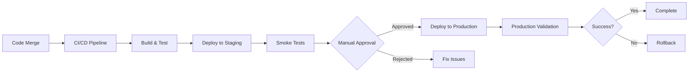

# HopNGo Deployment Runbook

This runbook provides comprehensive guidance for deploying HopNGo using Argo Rollouts with blue/green and canary strategies.

## Table of Contents

1. [Overview](#overview)
2. [Deployment Strategies](#deployment-strategies)
3. [Environment Promotion](#environment-promotion)
4. [Pre-Deployment Checklist](#pre-deployment-checklist)
5. [Deployment Process](#deployment-process)
6. [Monitoring & Validation](#monitoring--validation)
7. [Rollback Procedures](#rollback-procedures)
8. [Troubleshooting](#troubleshooting)
9. [Emergency Procedures](#emergency-procedures)

## Overview

HopNGo uses Argo Rollouts for progressive delivery with two main deployment strategies:

- **Blue/Green**: For production deployments requiring zero downtime
- **Canary**: For staging and gradual production rollouts with traffic splitting

### Architecture Components

- **Gateway Service**: Blue/Green deployment (critical path)
- **Core Services**: Canary deployment (auth, booking, social)
- **Supporting Services**: Canary deployment (chat, notifications, AI)
- **Database**: Flyway migrations with baseline checks
- **Frontend**: Blue/Green deployment

## Deployment Strategies

### Blue/Green Deployment

**When to Use:**
- Production deployments
- Critical services (gateway, frontend)
- When zero downtime is required
- Database schema changes

**Characteristics:**
- Instant traffic switch (0% → 100%)
- Full environment duplication
- Quick rollback capability
- Higher resource usage

**Services Using Blue/Green:**
```yaml
services:
  - gateway
  - frontend
  - auth-service (production only)
```

### Canary Deployment

**When to Use:**
- Staging deployments
- Non-critical services
- Feature testing with real traffic
- Gradual rollouts

**Characteristics:**
- Progressive traffic shift (25% → 50% → 100%)
- Real user validation
- Automated rollback on metrics
- Resource efficient

**Services Using Canary:**
```yaml
services:
  - booking-service
  - social-service
  - trip-planning-service
  - chat-service
  - notification-service
  - ai-service
  - market-service
  - emergency-service
```

## Environment Promotion

### Staging → Production Flow



### Approval Gates

1. **Staging Validation**
   - All smoke tests pass
   - Performance metrics within SLA
   - Security scans clean

2. **Production Approval**
   - Manual approval required
   - Business stakeholder sign-off
   - Maintenance window (if needed)

## Pre-Deployment Checklist

### Before Every Deployment

- [ ] **Code Quality**
  - [ ] All CI/CD checks pass
  - [ ] Code review completed
  - [ ] Security scan results reviewed

- [ ] **Infrastructure**
  - [ ] Kubernetes cluster healthy
  - [ ] Argo Rollouts controller running
  - [ ] Monitoring systems operational

- [ ] **Database**
  - [ ] Migration scripts validated
  - [ ] Backup completed
  - [ ] Rollback plan prepared

- [ ] **Dependencies**
  - [ ] External services available
  - [ ] Third-party APIs accessible
  - [ ] CDN and DNS configured

### Production-Specific Checklist

- [ ] **Business Readiness**
  - [ ] Stakeholder approval obtained
  - [ ] Customer communication sent (if needed)
  - [ ] Support team notified

- [ ] **Technical Readiness**
  - [ ] Staging environment validated
  - [ ] Load testing completed
  - [ ] Disaster recovery plan updated

## Deployment Process

### Automatic Staging Deployment

```bash
# Triggered automatically on main branch push
git push origin main

# Monitor deployment
kubectl argo rollouts get rollout auth-service -n hopngo-staging --watch
```

### Manual Production Deployment

```bash
# Trigger production deployment
gh workflow run deploy.yml -f environment=production

# Monitor rollout progress
kubectl argo rollouts get rollout gateway -n hopngo-production --watch

# Check rollout status
kubectl argo rollouts status gateway -n hopngo-production
```

### Database Migration

```bash
# Check migration job status
kubectl get jobs -n hopngo-production -l app=db-migration

# View migration logs
kubectl logs job/db-migration -n hopngo-production

# Verify database schema
kubectl exec -it deployment/postgres -n hopngo-production -- psql -U hopngo -d hopngo -c "\dt"
```

## Monitoring & Validation

### Key Metrics to Monitor

1. **Application Metrics**
   - Response time (p95 < 500ms)
   - Error rate (< 1%)
   - Throughput (requests/second)
   - Success rate (> 99%)

2. **Infrastructure Metrics**
   - CPU usage (< 70%)
   - Memory usage (< 80%)
   - Pod restart count
   - Network latency

3. **Business Metrics**
   - User login success rate
   - Booking completion rate
   - Search response time
   - Payment processing rate

### Validation Commands

```bash
# Check rollout health
kubectl argo rollouts get rollout <service-name> -n <namespace>

# View analysis results
kubectl describe analysisrun <analysis-name> -n <namespace>

# Check service endpoints
curl -f https://hopngo.com/api/v1/auth/health

# Run smoke tests
cd tests/smoke && npm run test:production
```

### Grafana Dashboards

- **Application Dashboard**: https://grafana.hopngo.com/d/app-overview
- **Infrastructure Dashboard**: https://grafana.hopngo.com/d/infra-overview
- **Business Metrics**: https://grafana.hopngo.com/d/business-metrics

## Rollback Procedures

### Automatic Rollback

Argo Rollouts automatically rolls back when:
- Analysis templates fail
- Error rate exceeds threshold (> 5%)
- Success rate drops below threshold (< 95%)

### Manual Rollback

#### Quick Rollback (Argo Rollouts)

```bash
# Rollback specific service
kubectl argo rollouts undo rollout <service-name> -n <namespace>

# Rollback to specific revision
kubectl argo rollouts undo rollout <service-name> --to-revision=2 -n <namespace>

# Abort current rollout
kubectl argo rollouts abort rollout <service-name> -n <namespace>
```

#### Full Environment Rollback

```bash
# Rollback all services to previous version
services=("gateway" "auth-service" "booking-service" "social-service")

for service in "${services[@]}"; do
  echo "Rolling back $service..."
  kubectl argo rollouts undo rollout $service -n hopngo-production
  kubectl argo rollouts get rollout $service -n hopngo-production --watch --timeout=300s
done
```

#### Database Rollback

```bash
# Create rollback migration job
kubectl apply -f - <<EOF
apiVersion: batch/v1
kind: Job
metadata:
  name: db-rollback-$(date +%s)
  namespace: hopngo-production
spec:
  template:
    spec:
      containers:
      - name: flyway-rollback
        image: flyway/flyway:9.8.1
        command: ["flyway", "undo"]
        env:
        - name: FLYWAY_URL
          value: "jdbc:postgresql://postgres:5432/hopngo"
        - name: FLYWAY_USER
          valueFrom:
            secretKeyRef:
              name: db-credentials
              key: username
        - name: FLYWAY_PASSWORD
          valueFrom:
            secretKeyRef:
              name: db-credentials
              key: password
      restartPolicy: Never
EOF
```

### Rollback Decision Matrix

| Issue Type | Severity | Action | Timeline |
|------------|----------|--------|-----------|
| High error rate (>10%) | Critical | Immediate rollback | < 2 minutes |
| Performance degradation | High | Rollback after 5 minutes | < 5 minutes |
| Feature bugs | Medium | Rollback or hotfix | < 15 minutes |
| UI issues | Low | Hotfix or next release | < 1 hour |

## Troubleshooting

### Common Issues

#### Rollout Stuck in Progressing

```bash
# Check rollout status
kubectl argo rollouts get rollout <service-name> -n <namespace>

# Check pod status
kubectl get pods -n <namespace> -l app=<service-name>

# Check events
kubectl get events -n <namespace> --sort-by='.lastTimestamp'

# Force promotion (if safe)
kubectl argo rollouts promote <service-name> -n <namespace>
```

#### Analysis Template Failures

```bash
# Check analysis run details
kubectl describe analysisrun <analysis-name> -n <namespace>

# Check metrics provider
kubectl get analysistemplate success-rate -n <namespace> -o yaml

# Verify Prometheus connectivity
kubectl exec -it deployment/prometheus -n monitoring -- wget -qO- http://localhost:9090/-/healthy
```

#### Database Migration Issues

```bash
# Check migration job logs
kubectl logs job/db-migration -n <namespace>

# Check database connectivity
kubectl exec -it deployment/postgres -n <namespace> -- pg_isready

# Verify migration table
kubectl exec -it deployment/postgres -n <namespace> -- psql -U hopngo -d hopngo -c "SELECT * FROM flyway_schema_history ORDER BY installed_on DESC LIMIT 5;"
```

### Debug Commands

```bash
# Get rollout details
kubectl argo rollouts get rollout <service-name> -n <namespace> -o yaml

# Watch rollout progress
kubectl argo rollouts get rollout <service-name> -n <namespace> --watch

# Check service mesh (if using Istio)
kubectl get virtualservice,destinationrule -n <namespace>

# Verify ingress configuration
kubectl get ingress -n <namespace>

# Check resource usage
kubectl top pods -n <namespace>
```

## Emergency Procedures

### Complete Service Outage

1. **Immediate Actions** (0-5 minutes)
   ```bash
   # Check overall system health
   kubectl get nodes
   kubectl get pods --all-namespaces | grep -v Running
   
   # Rollback all services
   kubectl argo rollouts undo rollout gateway -n hopngo-production
   ```

2. **Communication** (5-10 minutes)
   - Notify incident response team
   - Update status page
   - Prepare customer communication

3. **Investigation** (10-30 minutes)
   - Check monitoring dashboards
   - Review recent deployments
   - Analyze error logs

### Partial Service Degradation

1. **Assessment**
   ```bash
   # Check affected services
   kubectl argo rollouts list rollouts -n hopngo-production
   
   # Review metrics
   curl -s "http://prometheus:9090/api/v1/query?query=rate(http_requests_total[5m])"
   ```

2. **Targeted Rollback**
   ```bash
   # Rollback specific service
   kubectl argo rollouts undo rollout <affected-service> -n hopngo-production
   ```

### Database Issues

1. **Connection Issues**
   ```bash
   # Check database pod
   kubectl get pods -n hopngo-production -l app=postgres
   
   # Test connectivity
   kubectl exec -it deployment/auth-service -n hopngo-production -- nc -zv postgres 5432
   ```

2. **Migration Failures**
   ```bash
   # Check migration status
   kubectl logs job/db-migration -n hopngo-production
   
   # Manual intervention (if needed)
   kubectl exec -it deployment/postgres -n hopngo-production -- psql -U hopngo -d hopngo
   ```

### Contact Information

- **On-Call Engineer**: +1-555-0123
- **DevOps Team**: devops@hopngo.com
- **Incident Commander**: incidents@hopngo.com
- **Business Stakeholder**: product@hopngo.com

### Escalation Matrix

| Time | Action | Contact |
|------|--------|---------|
| 0-15 min | On-call engineer handles | DevOps team |
| 15-30 min | Escalate to team lead | Engineering manager |
| 30-60 min | Involve incident commander | CTO |
| 60+ min | Executive notification | CEO/Board |

---

**Last Updated**: December 2024  
**Version**: 1.0  
**Owner**: DevOps Team  
**Review Cycle**: Monthly