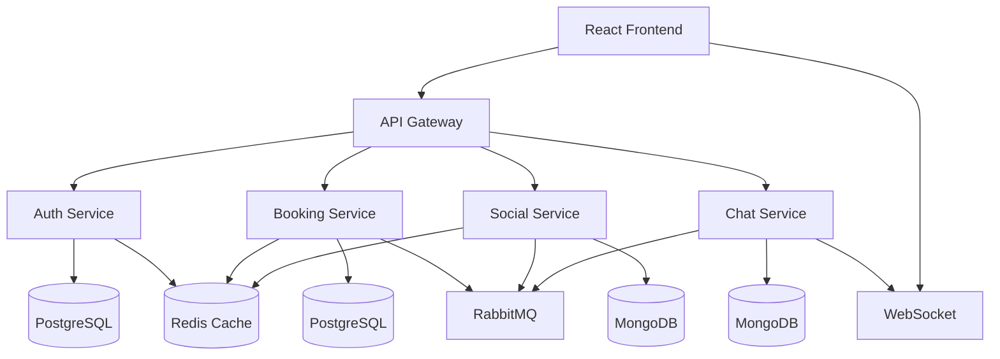

# Architecture Overview

HopNGo is built using a modern microservices architecture designed for scalability, maintainability, and developer productivity.

## System Architecture



## Core Principles

### 1. Microservices Architecture
- **Service Independence**: Each service can be developed, deployed, and scaled independently
- **Domain-Driven Design**: Services are organized around business capabilities
- **API-First**: All services expose well-defined REST APIs with OpenAPI documentation

### 2. Event-Driven Communication
- **Asynchronous Messaging**: Services communicate via RabbitMQ for loose coupling
- **Event Sourcing**: Critical business events are captured and stored
- **CQRS Pattern**: Separate read and write models where appropriate

### 3. Data Consistency
- **Database per Service**: Each service owns its data
- **Eventual Consistency**: Distributed transactions handled via saga pattern
- **Polyglot Persistence**: Different databases for different use cases

## Service Boundaries

### Auth Service
- **Responsibility**: User authentication, authorization, and profile management
- **Database**: PostgreSQL (relational data for users, roles, permissions)
- **Key Features**: JWT tokens, OAuth2, user registration, password reset

### Booking Service
- **Responsibility**: Vendor management, listing creation, booking processing
- **Database**: PostgreSQL (transactional data for bookings, payments)
- **Key Features**: Search, availability, pricing, payment processing

### Social Service
- **Responsibility**: Social features, posts, feeds, interactions
- **Database**: MongoDB (flexible schema for social content)
- **Key Features**: Posts, comments, likes, user feeds, media uploads

### Chat Service
- **Responsibility**: Real-time messaging and communication
- **Database**: MongoDB (message history, conversation metadata)
- **Key Features**: WebSocket connections, message delivery, chat rooms

## Technology Stack

### Backend
- **Framework**: Spring Boot 3.2
- **Language**: Java 17
- **Build Tool**: Maven
- **Documentation**: SpringDoc OpenAPI 3
- **Testing**: JUnit 5, Testcontainers, Pact

### Frontend
- **Framework**: React 18 with TypeScript
- **Build Tool**: Vite
- **State Management**: Context API + useReducer
- **Routing**: React Router
- **Testing**: Vitest, Playwright

### Infrastructure
- **Containerization**: Docker & Docker Compose
- **Databases**: PostgreSQL, MongoDB
- **Caching**: Redis
- **Message Queue**: RabbitMQ
- **Monitoring**: Prometheus, Grafana
- **Tracing**: OpenTelemetry

## Data Flow Patterns

### 1. Synchronous Communication
```
Client → Gateway → Service → Database → Response
```
Used for: User queries, real-time operations, critical transactions

### 2. Asynchronous Communication
```
Service A → RabbitMQ → Service B → Database
```
Used for: Event notifications, background processing, cross-service updates

### 3. WebSocket Communication
```
Client ↔ Chat Service ↔ WebSocket Server
```
Used for: Real-time messaging, live notifications, collaborative features

## Security Architecture

### Authentication Flow
1. User authenticates with Auth Service
2. JWT token issued with user claims
3. Gateway validates tokens for all requests
4. Services trust gateway-forwarded user context

### Authorization Patterns
- **Role-Based Access Control (RBAC)**: Users have roles with specific permissions
- **Resource-Based Authorization**: Fine-grained access control per resource
- **Service-to-Service**: Internal API keys for service communication

## Scalability Considerations

### Horizontal Scaling
- **Stateless Services**: All services are stateless and can be scaled horizontally
- **Load Balancing**: Gateway distributes requests across service instances
- **Database Sharding**: Planned for high-traffic scenarios

### Caching Strategy
- **Application Cache**: Redis for frequently accessed data
- **Database Query Cache**: Built-in PostgreSQL/MongoDB caching
- **CDN**: Static assets and media files

### Performance Optimization
- **Connection Pooling**: Efficient database connections
- **Async Processing**: Non-blocking I/O operations
- **Batch Operations**: Bulk data processing where possible

## Monitoring & Observability

### Metrics
- **Application Metrics**: Custom business metrics via Micrometer
- **Infrastructure Metrics**: System resources, database performance
- **User Experience**: Frontend performance, error rates

### Logging
- **Structured Logging**: JSON format with correlation IDs
- **Centralized Logs**: ELK stack for log aggregation
- **Log Levels**: Appropriate logging levels per environment

### Tracing
- **Distributed Tracing**: OpenTelemetry for request flow tracking
- **Performance Profiling**: Identify bottlenecks across services
- **Error Tracking**: Comprehensive error monitoring and alerting

## Development Practices

### Code Quality
- **Static Analysis**: SonarQube for code quality metrics
- **Code Reviews**: Mandatory peer reviews for all changes
- **Testing Strategy**: Unit, integration, contract, and E2E tests

### CI/CD Pipeline
- **Automated Testing**: All tests run on every commit
- **Container Builds**: Docker images built and pushed automatically
- **Deployment**: Blue-green deployments with rollback capability

### Documentation
- **API Documentation**: Auto-generated OpenAPI specs
- **Architecture Decisions**: ADRs for significant technical decisions
- **Runbooks**: Operational procedures and troubleshooting guides

## Future Considerations

### Planned Enhancements
- **Service Mesh**: Istio for advanced traffic management
- **Event Streaming**: Apache Kafka for high-throughput events
- **Multi-Region**: Geographic distribution for global users
- **Machine Learning**: Recommendation engine and personalization

### Technical Debt
- **Legacy Code**: Gradual refactoring of older components
- **Performance**: Ongoing optimization based on metrics
- **Security**: Regular security audits and updates