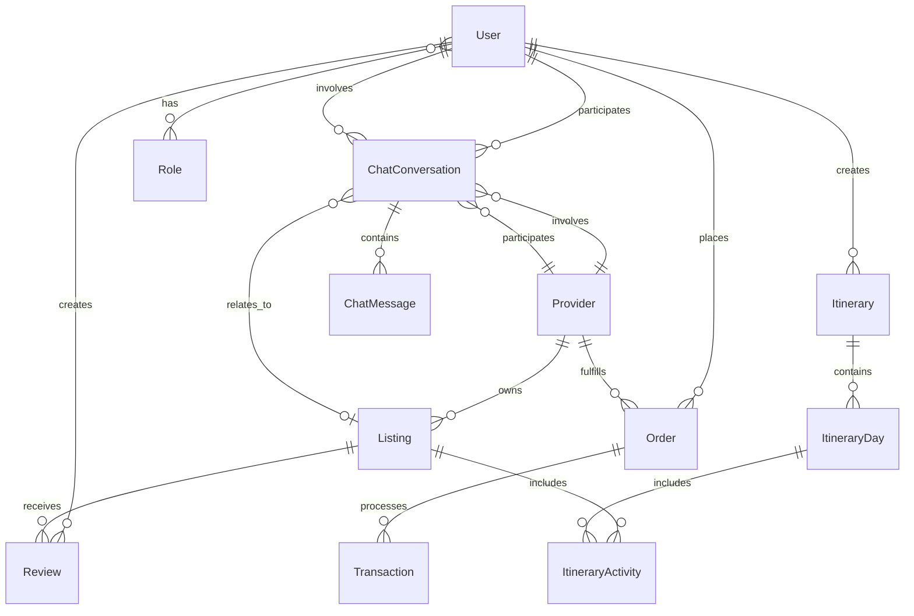

# Data Model

This document provides a comprehensive overview of the HopNGo platform's data model, including entity relationships, database schema, and business logic constraints.

## Overview

The HopNGo platform uses a PostgreSQL database with JPA/Hibernate for object-relational mapping. The data model is designed to support a multi-sided marketplace for travel and hospitality services in Bangladesh.

## Core Entities

### User Management

#### User
**Table:** `users`

| Field | Type | Constraints | Description |
|-------|------|-------------|-------------|
| id | BIGINT | PRIMARY KEY, AUTO_INCREMENT | Unique user identifier |
| first_name | VARCHAR(50) | NOT NULL | User's first name |
| last_name | VARCHAR(50) | NOT NULL | User's last name |
| email | VARCHAR(100) | NOT NULL, UNIQUE | User's email address |
| password | VARCHAR(120) | NOT NULL | Encrypted password |
| is_verified | BOOLEAN | DEFAULT false | Email verification status |
| is_active | BOOLEAN | DEFAULT true | Account active status |
| phone_number | VARCHAR | NULLABLE | User's phone number |
| date_of_birth | TIMESTAMP | NULLABLE | User's date of birth |
| profile_picture_url | VARCHAR | NULLABLE | Profile picture URL |
| bio | VARCHAR(500) | NULLABLE | User biography |
| preferred_language | VARCHAR | DEFAULT 'en' | Preferred language |
| timezone | VARCHAR | NULLABLE | User's timezone |
| created_at | TIMESTAMP | AUTO | Account creation timestamp |
| updated_at | TIMESTAMP | AUTO | Last update timestamp |

**Relationships:**
- One-to-Many with Reviews (as reviewer)
- One-to-Many with Itineraries (as creator)
- One-to-Many with Orders (as customer)
- One-to-Many with ChatConversations
- Many-to-Many with Roles (via user_roles table)

#### Role
**Enum Values:**
- `USER` - Regular platform user
- `PROVIDER` - Service provider
- `ADMIN` - System administrator
- `MODERATOR` - Content moderator
- `SUPPORT` - Customer support

### Service Providers

#### Provider
**Table:** `providers`

| Field | Type | Constraints | Description |
|-------|------|-------------|-------------|
| id | BIGINT | PRIMARY KEY, AUTO_INCREMENT | Unique provider identifier |
| email | VARCHAR | NOT NULL, UNIQUE | Provider's email |
| name | VARCHAR | NOT NULL | Provider/business name |
| phone | VARCHAR | NULLABLE | Contact phone number |
| service_type | VARCHAR | NULLABLE | Type of service offered |
| description | VARCHAR(1000) | NULLABLE | Provider description |
| is_active | BOOLEAN | DEFAULT true | Provider active status |
| total_earnings | DECIMAL(19,4) | DEFAULT 0 | Total earnings |
| rating | DECIMAL(3,2) | NULLABLE | Average rating |
| total_reviews | INTEGER | DEFAULT 0 | Total review count |
| metadata | TEXT | NULLABLE | Additional provider data |
| created_at | TIMESTAMP | AUTO | Registration timestamp |
| updated_at | TIMESTAMP | AUTO | Last update timestamp |

**Relationships:**
- One-to-Many with Listings
- One-to-Many with Orders
- One-to-Many with ChatConversations

### Listings & Services

#### Listing
**Table:** `listings`

| Field | Type | Constraints | Description |
|-------|------|-------------|-------------|
| id | BIGINT | PRIMARY KEY, AUTO_INCREMENT | Unique listing identifier |
| title | VARCHAR(200) | NOT NULL | Listing title |
| description | VARCHAR(3000) | NULLABLE | Detailed description |
| price | DECIMAL(19,2) | NOT NULL | Base price |
| currency | VARCHAR | DEFAULT 'BDT' | Price currency |
| location | VARCHAR | NOT NULL | Location name |
| address | VARCHAR | NULLABLE | Full address |
| latitude | DOUBLE | NULLABLE | GPS latitude |
| longitude | DOUBLE | NULLABLE | GPS longitude |
| listing_type | ENUM | NULLABLE | Type of listing |
| category | VARCHAR | NULLABLE | Listing category |
| subcategory | VARCHAR | NULLABLE | Listing subcategory |
| max_guests | INTEGER | NULLABLE | Maximum guest capacity |
| bedrooms | INTEGER | NULLABLE | Number of bedrooms |
| bathrooms | INTEGER | NULLABLE | Number of bathrooms |
| rating | DECIMAL(3,2) | NULLABLE | Average rating |
| review_count | INTEGER | DEFAULT 0 | Total reviews |
| is_active | BOOLEAN | DEFAULT true | Listing active status |
| is_featured | BOOLEAN | DEFAULT false | Featured listing flag |
| is_demo | BOOLEAN | DEFAULT false | Demo data flag |
| instant_book | BOOLEAN | DEFAULT false | Instant booking enabled |
| provider_id | BIGINT | FOREIGN KEY | Associated provider |
| created_at | TIMESTAMP | AUTO | Creation timestamp |
| updated_at | TIMESTAMP | AUTO | Last update timestamp |

**Related Tables:**
- `listing_images` - Image URLs collection
- `listing_amenities` - Amenities collection

**Listing Types:**
- `HOTEL`, `RESORT`, `GUESTHOUSE`, `APARTMENT`, `VILLA`, `TOUR`, `EXPERIENCE`, `RESTAURANT`

**Relationships:**
- Many-to-One with Provider
- One-to-Many with Reviews
- One-to-Many with ItineraryActivities

### Reviews & Ratings

#### Review
**Table:** `reviews`

| Field | Type | Constraints | Description |
|-------|------|-------------|-------------|
| id | BIGINT | PRIMARY KEY, AUTO_INCREMENT | Unique review identifier |
| rating | INTEGER | NOT NULL, MIN 1, MAX 5 | Star rating (1-5) |
| comment | VARCHAR(2000) | NULLABLE | Review comment |
| is_verified | BOOLEAN | DEFAULT false | Verified review flag |
| is_demo | BOOLEAN | DEFAULT false | Demo data flag |
| helpful_count | INTEGER | DEFAULT 0 | Helpful votes count |
| user_id | BIGINT | FOREIGN KEY | Reviewer |
| listing_id | BIGINT | FOREIGN KEY | Reviewed listing |
| created_at | TIMESTAMP | AUTO | Review timestamp |
| updated_at | TIMESTAMP | AUTO | Last update timestamp |

**Relationships:**
- Many-to-One with User (reviewer)
- Many-to-One with Listing (reviewed item)

### Travel Itineraries

#### Itinerary
**Table:** `itineraries`

| Field | Type | Constraints | Description |
|-------|------|-------------|-------------|
| id | BIGINT | PRIMARY KEY, AUTO_INCREMENT | Unique itinerary identifier |
| title | VARCHAR(200) | NOT NULL | Itinerary title |
| description | VARCHAR(3000) | NULLABLE | Detailed description |
| duration_days | INTEGER | NOT NULL | Trip duration in days |
| estimated_cost | DECIMAL(19,2) | NULLABLE | Estimated total cost |
| currency | VARCHAR | DEFAULT 'BDT' | Cost currency |
| difficulty_level | ENUM | NULLABLE | Trip difficulty |
| category | VARCHAR | NULLABLE | Itinerary category |
| cover_image_url | VARCHAR | NULLABLE | Cover image URL |
| is_template | BOOLEAN | DEFAULT false | Template flag |
| is_public | BOOLEAN | DEFAULT true | Public visibility |
| is_featured | BOOLEAN | DEFAULT false | Featured flag |
| is_demo | BOOLEAN | DEFAULT false | Demo data flag |
| view_count | INTEGER | DEFAULT 0 | View count |
| like_count | INTEGER | DEFAULT 0 | Like count |
| booking_count | INTEGER | DEFAULT 0 | Booking count |
| rating | DECIMAL(3,2) | NULLABLE | Average rating |
| review_count | INTEGER | DEFAULT 0 | Review count |
| creator_id | BIGINT | FOREIGN KEY | Itinerary creator |
| created_at | TIMESTAMP | AUTO | Creation timestamp |
| updated_at | TIMESTAMP | AUTO | Last update timestamp |

**Related Tables:**
- `itinerary_tags` - Tags collection
- `itinerary_destinations` - Destinations collection
- `itinerary_images` - Image URLs collection

**Difficulty Levels:**
- `EASY`, `MODERATE`, `CHALLENGING`, `EXTREME`

**Relationships:**
- Many-to-One with User (creator)
- One-to-Many with ItineraryDay

#### ItineraryDay
**Table:** `itinerary_days`

| Field | Type | Constraints | Description |
|-------|------|-------------|-------------|
| id | BIGINT | PRIMARY KEY, AUTO_INCREMENT | Unique day identifier |
| day_number | INTEGER | NOT NULL | Day number in itinerary |
| title | VARCHAR | NULLABLE | Day title |
| description | VARCHAR(2000) | NULLABLE | Day description |
| location | VARCHAR | NULLABLE | Primary location |
| itinerary_id | BIGINT | FOREIGN KEY | Parent itinerary |
| created_at | TIMESTAMP | AUTO | Creation timestamp |
| updated_at | TIMESTAMP | AUTO | Last update timestamp |

**Relationships:**
- Many-to-One with Itinerary
- One-to-Many with ItineraryActivity

#### ItineraryActivity
**Table:** `itinerary_activities`

| Field | Type | Constraints | Description |
|-------|------|-------------|-------------|
| id | BIGINT | PRIMARY KEY, AUTO_INCREMENT | Unique activity identifier |
| title | VARCHAR | NOT NULL | Activity title |
| description | VARCHAR(1000) | NULLABLE | Activity description |
| location | VARCHAR | NULLABLE | Activity location |
| latitude | DOUBLE | NULLABLE | GPS latitude |
| longitude | DOUBLE | NULLABLE | GPS longitude |
| start_time | TIME | NULLABLE | Start time |
| end_time | TIME | NULLABLE | End time |
| duration_minutes | INTEGER | NULLABLE | Duration in minutes |
| activity_type | ENUM | NULLABLE | Type of activity |
| cost | DECIMAL(19,2) | NULLABLE | Activity cost |
| currency | VARCHAR | DEFAULT 'BDT' | Cost currency |
| booking_required | BOOLEAN | DEFAULT false | Booking required flag |
| booking_url | VARCHAR | NULLABLE | Booking URL |
| contact_info | VARCHAR | NULLABLE | Contact information |
| notes | VARCHAR(500) | NULLABLE | Additional notes |
| image_url | VARCHAR | NULLABLE | Activity image |
| itinerary_day_id | BIGINT | FOREIGN KEY | Parent day |
| listing_id | BIGINT | FOREIGN KEY | Associated listing |
| created_at | TIMESTAMP | AUTO | Creation timestamp |
| updated_at | TIMESTAMP | AUTO | Last update timestamp |

**Activity Types:**
- `SIGHTSEEING`, `DINING`, `ACCOMMODATION`, `TRANSPORTATION`, `SHOPPING`, `ADVENTURE`, `CULTURAL`, `RELAXATION`, `ENTERTAINMENT`, `OTHER`

**Relationships:**
- Many-to-One with ItineraryDay
- Many-to-One with Listing (optional)

### Orders & Payments

#### Order
**Table:** `orders`

| Field | Type | Constraints | Description |
|-------|------|-------------|-------------|
| id | BIGINT | PRIMARY KEY, AUTO_INCREMENT | Unique order identifier |
| order_number | VARCHAR | NOT NULL, UNIQUE | Human-readable order number |
| status | ENUM | NOT NULL | Order status |
| total_amount | DECIMAL(19,4) | NOT NULL, > 0 | Total order amount |
| platform_fee | DECIMAL(19,4) | NOT NULL, >= 0 | Platform fee |
| provider_fee | DECIMAL(19,4) | NOT NULL, >= 0 | Provider fee |
| currency | VARCHAR(3) | NOT NULL | Currency code |
| description | VARCHAR(1000) | NULLABLE | Order description |
| metadata | TEXT | NULLABLE | Additional order data |
| user_id | BIGINT | FOREIGN KEY, NOT NULL | Customer |
| provider_id | BIGINT | FOREIGN KEY | Service provider |
| created_at | TIMESTAMP | AUTO | Order creation timestamp |
| updated_at | TIMESTAMP | AUTO | Last update timestamp |
| completed_at | TIMESTAMP | NULLABLE | Completion timestamp |
| cancelled_at | TIMESTAMP | NULLABLE | Cancellation timestamp |

**Order Status:**
- `PENDING` - Awaiting payment
- `PROCESSING` - Being processed
- `COMPLETED` - Successfully completed
- `CANCELLED` - Cancelled
- `REFUNDED` - Refunded
- `DISPUTED` - Under dispute

**Relationships:**
- Many-to-One with User (customer)
- Many-to-One with Provider
- One-to-Many with Transaction

#### Transaction
**Table:** `transactions`

| Field | Type | Constraints | Description |
|-------|------|-------------|-------------|
| id | BIGINT | PRIMARY KEY, AUTO_INCREMENT | Unique transaction identifier |
| transaction_id | VARCHAR | NOT NULL, UNIQUE | External transaction ID |
| provider_transaction_id | VARCHAR | NULLABLE | Provider's transaction ID |
| payment_provider | ENUM | NOT NULL | Payment gateway used |
| transaction_type | ENUM | NOT NULL | Type of transaction |
| status | ENUM | NOT NULL | Transaction status |
| amount | DECIMAL(19,4) | NOT NULL, > 0 | Transaction amount |
| fee | DECIMAL(19,4) | NOT NULL, >= 0 | Transaction fee |
| processing_fee | DECIMAL(19,4) | DEFAULT 0 | Processing fee |
| platform_fee | DECIMAL(19,4) | DEFAULT 0 | Platform fee |
| currency | VARCHAR(3) | NOT NULL | Currency code |
| gateway_response | TEXT | NULLABLE | Gateway response data |
| failure_reason | VARCHAR | NULLABLE | Failure reason |
| reconciled | BOOLEAN | DEFAULT false | Reconciliation status |
| reconciled_at | TIMESTAMP | NULLABLE | Reconciliation timestamp |
| dispute_id | VARCHAR | NULLABLE | Dispute identifier |
| disputed_at | TIMESTAMP | NULLABLE | Dispute timestamp |
| refund_id | VARCHAR | NULLABLE | Refund identifier |
| refunded_at | TIMESTAMP | NULLABLE | Refund timestamp |
| refund_amount | DECIMAL(19,4) | NULLABLE | Refund amount |
| order_id | BIGINT | FOREIGN KEY, NOT NULL | Associated order |
| created_at | TIMESTAMP | AUTO | Transaction timestamp |
| updated_at | TIMESTAMP | AUTO | Last update timestamp |
| processed_at | TIMESTAMP | NULLABLE | Processing timestamp |

**Payment Providers:**
- `STRIPE` - International payments
- `BKASH` - Bangladesh mobile payments
- `NAGAD` - Bangladesh mobile payments

**Transaction Types:**
- `PAYMENT` - Regular payment
- `REFUND` - Refund transaction
- `CHARGEBACK` - Chargeback
- `ADJUSTMENT` - Manual adjustment

**Transaction Status:**
- `PENDING` - Being processed
- `SUCCESS` - Completed successfully
- `FAILED` - Failed
- `CANCELLED` - Cancelled
- `DISPUTED` - Under dispute

**Relationships:**
- Many-to-One with Order

### Communication

#### ChatConversation
**Table:** `chat_conversations`

| Field | Type | Constraints | Description |
|-------|------|-------------|-------------|
| id | BIGINT | PRIMARY KEY, AUTO_INCREMENT | Unique conversation identifier |
| title | VARCHAR | NULLABLE | Conversation title |
| conversation_type | ENUM | NULLABLE | Type of conversation |
| status | ENUM | DEFAULT 'ACTIVE' | Conversation status |
| is_demo | BOOLEAN | DEFAULT false | Demo data flag |
| last_message_at | TIMESTAMP | NULLABLE | Last message timestamp |
| user_id | BIGINT | FOREIGN KEY | Participating user |
| provider_id | BIGINT | FOREIGN KEY | Participating provider |
| listing_id | BIGINT | FOREIGN KEY | Related listing |
| created_at | TIMESTAMP | AUTO | Creation timestamp |
| updated_at | TIMESTAMP | AUTO | Last update timestamp |

**Conversation Types:**
- `BOOKING_INQUIRY` - Booking-related inquiry
- `SUPPORT` - Customer support
- `GENERAL` - General conversation
- `EMERGENCY` - Emergency communication

**Conversation Status:**
- `ACTIVE` - Active conversation
- `CLOSED` - Closed conversation
- `ARCHIVED` - Archived conversation

**Relationships:**
- Many-to-One with User
- Many-to-One with Provider
- Many-to-One with Listing (optional)
- One-to-Many with ChatMessage

#### ChatMessage
**Table:** `chat_messages`

| Field | Type | Constraints | Description |
|-------|------|-------------|-------------|
| id | BIGINT | PRIMARY KEY, AUTO_INCREMENT | Unique message identifier |
| content | VARCHAR(2000) | NOT NULL | Message content |
| sender_type | ENUM | NOT NULL | Type of sender |
| message_type | ENUM | DEFAULT 'TEXT' | Type of message |
| is_read | BOOLEAN | DEFAULT false | Read status |
| is_demo | BOOLEAN | DEFAULT false | Demo data flag |
| attachment_url | VARCHAR | NULLABLE | Attachment URL |
| attachment_type | VARCHAR | NULLABLE | Attachment MIME type |
| metadata | TEXT | NULLABLE | Additional message data |
| conversation_id | BIGINT | FOREIGN KEY | Parent conversation |
| sender_user_id | BIGINT | FOREIGN KEY | Sender (if user) |
| sender_provider_id | BIGINT | FOREIGN KEY | Sender (if provider) |
| created_at | TIMESTAMP | AUTO | Message timestamp |
| updated_at | TIMESTAMP | AUTO | Last update timestamp |

**Sender Types:**
- `USER` - Regular user
- `PROVIDER` - Service provider
- `SYSTEM` - System message
- `AI_ASSISTANT` - AI assistant

**Message Types:**
- `TEXT` - Text message
- `IMAGE` - Image message
- `FILE` - File attachment
- `LOCATION` - Location sharing
- `BOOKING_REQUEST` - Booking request
- `BOOKING_CONFIRMATION` - Booking confirmation
- `EMERGENCY_ALERT` - Emergency alert

**Relationships:**
- Many-to-One with ChatConversation
- Many-to-One with User (optional sender)
- Many-to-One with Provider (optional sender)

## Database Configuration

### Connection Settings
- **Database:** PostgreSQL
- **Host:** localhost:5432
- **Database Name:** hopngo
- **Schema:** public
- **Dialect:** PostgreSQL

### JPA Configuration
- **DDL Auto:** create-drop (development)
- **Show SQL:** false
- **Format SQL:** true
- **Naming Strategy:** Default Hibernate naming

## Entity Relationship Diagram

## Indexing Strategy

### Primary Indexes
- All primary keys (id fields) are automatically indexed
- Unique constraints on email fields create unique indexes

### Recommended Secondary Indexes
- `users.email` - User lookup
- `listings.location` - Location-based search
- `listings.listing_type` - Category filtering
- `listings.is_active` - Active listings
- `reviews.listing_id` - Listing reviews
- `orders.user_id` - User orders
- `orders.status` - Order status filtering
- `transactions.order_id` - Order transactions
- `chat_messages.conversation_id` - Conversation messages

## Data Integrity

### Constraints
- Foreign key constraints ensure referential integrity
- Check constraints on rating fields (1-5 range)
- Not null constraints on required fields
- Unique constraints on business identifiers

### Validation
- Email format validation
- Price and amount positive value validation
- String length constraints
- Enum value validation

### Audit Trail
- All entities include `created_at` and `updated_at` timestamps
- Soft delete pattern for user accounts
- Transaction history preservation

## Performance Considerations

### Lazy Loading
- Most relationships use `FetchType.LAZY` to avoid N+1 queries
- Collection mappings are lazy by default

### Pagination
- Large result sets should use pagination
- Repository methods support Pageable parameters

### Caching
- Redis integration for session management
- Consider entity-level caching for frequently accessed data

### Query Optimization
- Use projection queries for read-only operations
- Implement database views for complex reporting queries
- Monitor and optimize slow queries

## Migration Strategy

### Development
- `ddl-auto: create-drop` for development environments
- Database recreated on application restart

### Production
- Use Flyway or Liquibase for schema migrations
- Version-controlled migration scripts
- Backward-compatible changes when possible

### Data Seeding
- Demo data scripts for development and testing
- Production data import procedures
- Data validation and cleanup scripts