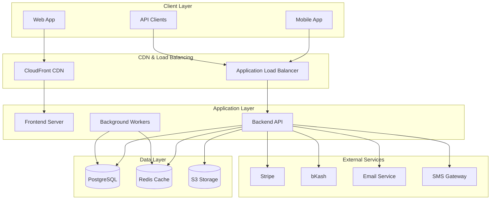

# Operations

This document provides comprehensive operational guidance for managing, monitoring, and maintaining the HopNGo platform in production environments.

## System Architecture

### High-Level Architecture



### Infrastructure Components

#### Compute Resources
- **Frontend**: React.js application served via Nginx
- **Backend**: Spring Boot application on JVM
- **Workers**: Background job processors
- **Load Balancer**: AWS Application Load Balancer

#### Data Storage
- **Primary Database**: PostgreSQL 14+ (AWS RDS)
- **Cache Layer**: Redis 6+ (AWS ElastiCache)
- **File Storage**: AWS S3 with CloudFront CDN
- **Search Engine**: Elasticsearch (planned)

#### Networking
- **VPC**: Private network with public/private subnets
- **Security Groups**: Firewall rules for each service
- **Route 53**: DNS management
- **CloudFront**: Global content delivery

## Environment Management

### Environment Tiers

| Environment | Purpose | Infrastructure | Data |
|-------------|---------|----------------|------|
| **Development** | Local development | Docker Compose | Synthetic data |
| **Staging** | Pre-production testing | Scaled-down AWS | Anonymized production data |
| **Production** | Live system | Full AWS infrastructure | Real user data |
| **DR** | Disaster recovery | Cross-region AWS | Production replica |

### Environment Configuration

#### Development Environment
```yaml
# docker-compose.yml
version: '3.8'
services:
  frontend:
    build: ./frontend
    ports:
      - "3000:3000"
    environment:
      - NODE_ENV=development
      - REACT_APP_API_URL=http://localhost:8080
  
  backend:
    build: ./backend
    ports:
      - "8080:8080"
    environment:
      - SPRING_PROFILES_ACTIVE=development
      - DATABASE_URL=jdbc:postgresql://postgres:5432/hopngo
    depends_on:
      - postgres
      - redis
  
  postgres:
    image: postgres:14
    environment:
      - POSTGRES_DB=hopngo
      - POSTGRES_USER=hopngo
      - POSTGRES_PASSWORD=password
    volumes:
      - postgres_data:/var/lib/postgresql/data
  
  redis:
    image: redis:6-alpine
    ports:
      - "6379:6379"
```

#### Production Environment Variables
```bash
# Backend Configuration
SPRING_PROFILES_ACTIVE=production
DATABASE_URL=jdbc:postgresql://prod-db.region.rds.amazonaws.com:5432/hopngo
REDIS_URL=redis://prod-cache.region.cache.amazonaws.com:6379
JWT_SECRET=${JWT_SECRET}
STRIPE_SECRET_KEY=${STRIPE_SECRET_KEY}
BKASH_API_KEY=${BKASH_API_KEY}
AWS_ACCESS_KEY_ID=${AWS_ACCESS_KEY_ID}
AWS_SECRET_ACCESS_KEY=${AWS_SECRET_ACCESS_KEY}
S3_BUCKET_NAME=hopngo-prod-assets

# Frontend Configuration
REACT_APP_API_URL=https://api.hopngo.com
REACT_APP_STRIPE_PUBLISHABLE_KEY=${STRIPE_PUBLISHABLE_KEY}
REACT_APP_GOOGLE_MAPS_API_KEY=${GOOGLE_MAPS_API_KEY}
```

## Deployment Procedures

### CI/CD Pipeline

#### GitHub Actions Workflow
```yaml
# .github/workflows/deploy.yml
name: Deploy to Production

on:
  push:
    branches: [main]
  pull_request:
    branches: [main]

jobs:
  test:
    runs-on: ubuntu-latest
    steps:
      - uses: actions/checkout@v3
      - name: Setup Node.js
        uses: actions/setup-node@v3
        with:
          node-version: '18'
      - name: Setup Java
        uses: actions/setup-java@v3
        with:
          java-version: '17'
      
      - name: Test Frontend
        run: |
          cd frontend
          npm ci
          npm run test
          npm run build
      
      - name: Test Backend
        run: |
          cd backend
          ./mvnw test
          ./mvnw package
  
  deploy:
    needs: test
    runs-on: ubuntu-latest
    if: github.ref == 'refs/heads/main'
    steps:
      - name: Deploy to AWS
        run: |
          # Deployment scripts
          ./scripts/deploy.sh production
```

### Deployment Strategies

#### Blue-Green Deployment
1. **Prepare Green Environment**: Deploy new version to inactive environment
2. **Health Checks**: Verify application health and functionality
3. **Switch Traffic**: Route traffic from blue to green environment
4. **Monitor**: Watch metrics and error rates
5. **Rollback**: Switch back to blue if issues detected

#### Rolling Deployment
1. **Update Instances**: Deploy to subset of instances
2. **Health Verification**: Check instance health
3. **Continue Rolling**: Deploy to remaining instances
4. **Complete**: All instances updated successfully

### Deployment Scripts

#### Frontend Deployment
```bash
#!/bin/bash
# scripts/deploy-frontend.sh

set -e

ENVIRONMENT=${1:-staging}
BUILD_DIR="frontend/build"
S3_BUCKET="hopngo-${ENVIRONMENT}-frontend"
CLOUDFRONT_ID="E1234567890ABC"

echo "Building frontend for ${ENVIRONMENT}..."
cd frontend
npm ci
npm run build

echo "Deploying to S3..."
aws s3 sync ${BUILD_DIR} s3://${S3_BUCKET} --delete

echo "Invalidating CloudFront cache..."
aws cloudfront create-invalidation \
  --distribution-id ${CLOUDFRONT_ID} \
  --paths "/*"

echo "Frontend deployment complete!"
```

#### Backend Deployment
```bash
#!/bin/bash
# scripts/deploy-backend.sh

set -e

ENVIRONMENT=${1:-staging}
APP_NAME="hopngo-backend"
JAR_FILE="backend/target/hopngo-backend.jar"

echo "Building backend application..."
cd backend
./mvnw clean package -DskipTests

echo "Deploying to Elastic Beanstalk..."
eb deploy ${APP_NAME}-${ENVIRONMENT}

echo "Waiting for deployment to complete..."
eb health ${APP_NAME}-${ENVIRONMENT}

echo "Backend deployment complete!"
```

## Monitoring & Observability

### Application Monitoring

#### Key Metrics

**Performance Metrics**
- Response time (p50, p95, p99)
- Throughput (requests per second)
- Error rate (4xx, 5xx responses)
- Database query performance
- Cache hit ratio

**Business Metrics**
- User registrations
- Booking conversions
- Revenue metrics
- Provider onboarding
- Search success rate

**Infrastructure Metrics**
- CPU utilization
- Memory usage
- Disk I/O
- Network throughput
- Database connections

#### Monitoring Stack

**AWS CloudWatch**
```json
{
  "MetricName": "ResponseTime",
  "Namespace": "HopNGo/API",
  "Dimensions": [
    {
      "Name": "Environment",
      "Value": "production"
    },
    {
      "Name": "Endpoint",
      "Value": "/api/listings"
    }
  ],
  "Value": 250,
  "Unit": "Milliseconds"
}
```

**Application Performance Monitoring**
```java
// Micrometer metrics in Spring Boot
@RestController
public class ListingController {
    
    private final MeterRegistry meterRegistry;
    private final Timer.Sample sample;
    
    @GetMapping("/api/listings")
    @Timed(name = "listing.search", description = "Time taken to search listings")
    public ResponseEntity<List<Listing>> searchListings() {
        Counter.builder("listing.search.requests")
            .tag("endpoint", "search")
            .register(meterRegistry)
            .increment();
        
        // Business logic
        return ResponseEntity.ok(listings);
    }
}
```

### Logging Strategy

#### Log Levels
- **ERROR**: System errors, exceptions
- **WARN**: Potential issues, deprecated usage
- **INFO**: Important business events
- **DEBUG**: Detailed execution flow
- **TRACE**: Very detailed debugging

#### Structured Logging
```java
// Logback configuration with JSON format
@Slf4j
@RestController
public class BookingController {
    
    @PostMapping("/api/bookings")
    public ResponseEntity<Booking> createBooking(@RequestBody BookingRequest request) {
        MDC.put("userId", request.getUserId().toString());
        MDC.put("listingId", request.getListingId().toString());
        MDC.put("operation", "create_booking");
        
        log.info("Creating booking for user {} and listing {}", 
                request.getUserId(), request.getListingId());
        
        try {
            Booking booking = bookingService.createBooking(request);
            log.info("Booking created successfully with ID {}", booking.getId());
            return ResponseEntity.ok(booking);
        } catch (Exception e) {
            log.error("Failed to create booking", e);
            throw e;
        } finally {
            MDC.clear();
        }
    }
}
```

#### Log Aggregation
```yaml
# ELK Stack configuration
filebeat:
  inputs:
    - type: log
      paths:
        - /var/log/hopngo/*.log
      fields:
        service: hopngo-backend
        environment: production
  output:
    elasticsearch:
      hosts: ["elasticsearch:9200"]

logstash:
  input:
    beats:
      port: 5044
  filter:
    json:
      source: message
    date:
      match: ["timestamp", "ISO8601"]
  output:
    elasticsearch:
      hosts: ["elasticsearch:9200"]
      index: "hopngo-logs-%{+YYYY.MM.dd}"
```

### Alerting

#### Alert Rules

**Critical Alerts (Immediate Response)**
- Application down (5xx error rate > 50%)
- Database connection failures
- Payment processing failures
- Security incidents

**Warning Alerts (Within 30 minutes)**
- High response times (p95 > 2 seconds)
- High error rates (4xx > 10%)
- Low cache hit ratio (< 80%)
- High CPU/Memory usage (> 80%)

**Info Alerts (Within 2 hours)**
- Unusual traffic patterns
- Low conversion rates
- High bounce rates
- Capacity planning thresholds

#### Alert Configuration
```yaml
# Prometheus alert rules
groups:
  - name: hopngo.rules
    rules:
      - alert: HighErrorRate
        expr: rate(http_requests_total{status=~"5.."}[5m]) > 0.1
        for: 5m
        labels:
          severity: critical
        annotations:
          summary: "High error rate detected"
          description: "Error rate is {{ $value }} errors per second"
      
      - alert: HighResponseTime
        expr: histogram_quantile(0.95, rate(http_request_duration_seconds_bucket[5m])) > 2
        for: 10m
        labels:
          severity: warning
        annotations:
          summary: "High response time detected"
          description: "95th percentile response time is {{ $value }} seconds"
```

## Scaling & Performance

### Horizontal Scaling

#### Auto Scaling Configuration
```yaml
# AWS Auto Scaling Group
AutoScalingGroup:
  Type: AWS::AutoScaling::AutoScalingGroup
  Properties:
    MinSize: 2
    MaxSize: 10
    DesiredCapacity: 3
    TargetGroupARNs:
      - !Ref ApplicationLoadBalancerTargetGroup
    LaunchTemplate:
      LaunchTemplateId: !Ref LaunchTemplate
      Version: !GetAtt LaunchTemplate.LatestVersionNumber
    
ScalingPolicy:
  Type: AWS::AutoScaling::ScalingPolicy
  Properties:
    PolicyType: TargetTrackingScaling
    TargetTrackingConfiguration:
      TargetValue: 70.0
      PredefinedMetricSpecification:
        PredefinedMetricType: ASGAverageCPUUtilization
```

#### Database Scaling
- **Read Replicas**: Scale read operations
- **Connection Pooling**: Optimize database connections
- **Query Optimization**: Improve query performance
- **Caching Strategy**: Reduce database load

### Performance Optimization

#### Frontend Optimization
```javascript
// Code splitting and lazy loading
const ListingPage = lazy(() => import('./pages/ListingPage'));
const BookingPage = lazy(() => import('./pages/BookingPage'));

// Image optimization
const OptimizedImage = ({ src, alt, ...props }) => {
  return (
    
  );
};

// Service worker for caching
if ('serviceWorker' in navigator) {
  navigator.serviceWorker.register('/sw.js');
}
```

#### Backend Optimization
```java
// Database query optimization
@Query("SELECT l FROM Listing l JOIN FETCH l.images WHERE l.isActive = true")
List<Listing> findActiveListingsWithImages();

// Caching implementation
@Cacheable(value = "listings", key = "#location + '_' + #category")
public List<Listing> searchListings(String location, String category) {
    return listingRepository.findByLocationAndCategory(location, category);
}

// Async processing
@Async
public CompletableFuture<Void> sendBookingConfirmation(Booking booking) {
    emailService.sendConfirmation(booking);
    return CompletableFuture.completedFuture(null);
}
```

## Backup & Recovery

### Backup Strategy

#### Database Backups
- **Automated Backups**: Daily RDS snapshots
- **Point-in-Time Recovery**: 7-day retention
- **Cross-Region Backups**: Disaster recovery
- **Backup Verification**: Regular restore testing

#### File Storage Backups
- **S3 Versioning**: File version history
- **Cross-Region Replication**: Geographic redundancy
- **Lifecycle Policies**: Automated archival

#### Configuration Backups
- **Infrastructure as Code**: Terraform/CloudFormation
- **Application Configuration**: Version controlled
- **Secrets Management**: AWS Secrets Manager

### Disaster Recovery

#### Recovery Time Objectives (RTO)
- **Critical Systems**: 1 hour
- **Non-Critical Systems**: 4 hours
- **Data Recovery**: 15 minutes

#### Recovery Point Objectives (RPO)
- **Database**: 5 minutes
- **File Storage**: 1 hour
- **Configuration**: Real-time

#### DR Procedures
1. **Incident Declaration**: Activate DR team
2. **Assessment**: Evaluate damage and requirements
3. **Failover**: Switch to DR environment
4. **Communication**: Notify stakeholders
5. **Recovery**: Restore primary systems
6. **Failback**: Return to normal operations

## Maintenance Procedures

### Scheduled Maintenance

#### Weekly Maintenance
- Security patch updates
- Database maintenance
- Log rotation and cleanup
- Performance review

#### Monthly Maintenance
- Dependency updates
- Security scans
- Capacity planning review
- Backup verification

#### Quarterly Maintenance
- Major version updates
- Architecture review
- Disaster recovery testing
- Security audit

### Maintenance Windows
- **Primary Window**: Sunday 2:00-4:00 AM UTC
- **Emergency Window**: Any time with approval
- **Notification**: 48 hours advance notice
- **Rollback Plan**: Always prepared

### Update Procedures

#### Security Updates
```bash
#!/bin/bash
# Security update procedure

# 1. Test in staging
echo "Applying security updates to staging..."
kubectl set image deployment/hopngo-backend hopngo-backend=hopngo:latest-security
kubectl rollout status deployment/hopngo-backend

# 2. Run security tests
echo "Running security tests..."
npm run test:security

# 3. Deploy to production if tests pass
if [ $? -eq 0 ]; then
    echo "Security tests passed. Deploying to production..."
    kubectl set image deployment/hopngo-backend hopngo-backend=hopngo:latest-security --namespace=production
    kubectl rollout status deployment/hopngo-backend --namespace=production
else
    echo "Security tests failed. Aborting deployment."
    exit 1
fi
```

## Troubleshooting

### Common Issues

#### High Response Times
**Symptoms**: Slow API responses, user complaints
**Investigation**:
1. Check application metrics
2. Review database performance
3. Analyze slow query logs
4. Check cache hit rates

**Resolution**:
1. Scale application instances
2. Optimize database queries
3. Increase cache TTL
4. Enable CDN caching

#### Database Connection Issues
**Symptoms**: Connection timeouts, pool exhaustion
**Investigation**:
1. Check connection pool metrics
2. Review database logs
3. Monitor active connections
4. Check network connectivity

**Resolution**:
1. Increase connection pool size
2. Optimize connection usage
3. Implement connection retry logic
4. Scale database resources

#### Memory Leaks
**Symptoms**: Increasing memory usage, OOM errors
**Investigation**:
1. Generate heap dumps
2. Analyze memory usage patterns
3. Review garbage collection logs
4. Profile application memory

**Resolution**:
1. Fix memory leaks in code
2. Tune JVM parameters
3. Increase heap size
4. Implement memory monitoring

### Debugging Tools

#### Application Debugging
```bash
# JVM debugging
jstack <pid>  # Thread dump
jmap -dump:live,format=b,file=heap.hprof <pid>  # Heap dump
jstat -gc <pid> 1s  # GC monitoring

# Database debugging
psql -h localhost -U hopngo -d hopngo
SELECT * FROM pg_stat_activity WHERE state = 'active';
EXPLAIN ANALYZE SELECT * FROM listings WHERE location = 'Dhaka';

# Network debugging
netstat -tulpn | grep :8080
tcpdump -i eth0 port 8080
curl -v https://api.hopngo.com/health
```

## Security Operations

### Security Monitoring
- **Log Analysis**: Automated security log analysis
- **Intrusion Detection**: Real-time threat detection
- **Vulnerability Scanning**: Regular security scans
- **Compliance Monitoring**: Regulatory compliance checks

### Incident Response
- **Security Team**: 24/7 security operations center
- **Response Procedures**: Documented incident response
- **Forensic Capabilities**: Security incident investigation
- **Communication Plan**: Stakeholder notification procedures

## Cost Optimization

### Resource Optimization
- **Right-sizing**: Match resources to actual usage
- **Reserved Instances**: Long-term cost savings
- **Spot Instances**: Cost-effective compute for batch jobs
- **Auto Scaling**: Scale resources based on demand

### Monitoring Costs
- **Cost Alerts**: Budget threshold notifications
- **Resource Tagging**: Track costs by service/team
- **Usage Reports**: Regular cost analysis
- **Optimization Recommendations**: AWS Cost Explorer insights

---

*This operations guide is maintained by the DevOps team and updated monthly to reflect current procedures and best practices.*